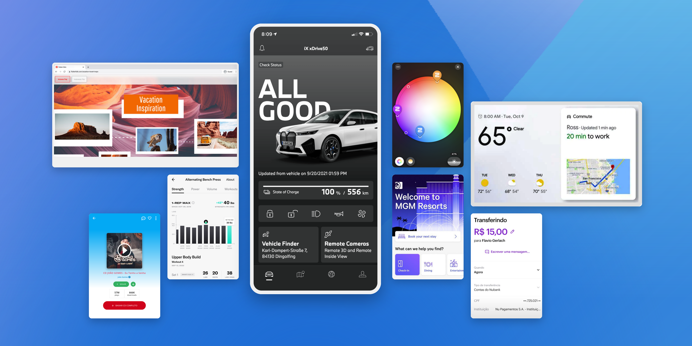

## **1\. Basic questions and comparisons.**

### **What is flutter?**
Flutter is an open-source cross-platform application SDK developed by Google. It is used to develop both Android and iOS applications. Flutter is written in Dart language. Those familiar with Object-Oriented Languages such as Java, Javascript, Objective C or Swift can easily relate to Dart.

### **Cross platform vs Native**
-   Cross platform apps are built using a single codebase and can be deployed on multiple platforms.
-  Cross platform apps are cheaper to develop and maintain.
-  Native apps are faster and more responsive(Not in the case of flutter).

### **Why cross platform?**

-   Saves companies the need to employ different iOS and Android developers to build the same app since it supports cross-platforms development.
-   Eliminates building same interface twice hence saving time

### **Flutter vs React Native**

 The main distinction between flutter and React Native is that flutter has a rendering engine that is written in C++ and is not dependent on the native platform. This means that flutter can be used to build applications for any platform.

### **Why Flutter?**
-   Allows you to experience native look and feel of mobile applications
-   Allows you create 2D effects ,games and animation
-   High velocity development giving the hot reload feature

## **2\. Installing Flutter**

### - Install Visual Studio Code from [here](https://code.visualstudio.com/download) and install the the Flutter extension.

### - Install Flutter SDK from [here](https://flutter.dev/docs/get-started/install)


Now check if flutter is installed by running the following command in your terminal

    flutter doctor

If you get the following output, then you are good to go.
    
        Doctor summary (to see all details, run flutter doctor -v):
        [✓] Flutter (Channel stable, 1.22.6, on Mac OS X 10.15.7 19H2, locale en-NG)
        [✓] Android toolchain - develop for Android devices (Android SDK version 30.0.2)
        [✓] Xcode - develop for iOS and macOS (Xcode 12.4)
        [✓] Chrome - develop for the web
        [✓] Android Studio (version 4.1)
        [✓] VS Code (version 1.54.3)
        [✓] Connected device (3 available)
    
        • No issues found!


## **3\. Creating a flutter project**
To create a flutter project, run the following command in your terminal

    flutter create project_name

This will create a flutter project with the name project_name in the current directory.


## **4\. Running the project**
Open the project in VSCode and run the project. You can run the project by clicking the run button or by running the following command in your terminal

    flutter run


## **5\. Getting started with flutter**
### Folder Structure
    
    ├── android
    ├── build
    ├── ios
    ├── lib //This is where you write your code
        ├── main.dart //This is where you start your app
    ├── test
    ├── .gitignore
    ├── .metadata
    ├── .packages
    ├── .vscode
    ├── README.md
    ├── analysis_options.yaml
    ├── assets
    ├── flutter.iml
    ├── pubspec.lock
    ├── pubspec.yaml // This is where you add dependencies


### **Adding dependencies and configuration**
To add dependencies to your project, open the *pubspec.yaml* file and add the dependencies you want to add.

```yaml
name: namer_app
description: A new Flutter project.

publish_to: 'none' # Remove this line if you wish to publish to pub.dev

version: 0.0.1+1

environment:
  sdk: '>=2.18.4 <3.0.0'

dependencies:
  flutter:
    sdk: flutter

dev_dependencies:
  flutter_test:
    sdk: flutter

  flutter_lints: ^2.0.0

flutter:
  uses-material-design: true
```

### **Smallest app you can build**

*main.dart*
```dart
import 'package:flutter/material.dart';

void main() {
  runApp(MyApp());
}

class MyApp extends StatelessWidget {
  @override
  Widget build(BuildContext context) {
    return MaterialApp(
      title: 'Flutter Demo',
      theme: ThemeData(
        primarySwatch: Colors.blue,
      ),
      home: Text('title'),
    );
  }
}
```

### **Widgets**
The smallest unit of a flutter app is a widget. Widgets are immutable and are used to build the UI of your app. Widgets are either stateless or stateful. Stateless widgets are widgets that do not change their state. Stateful widgets are widgets that change their state.

Some widgets:
- Text
- Row, Column
- Stack
- Container


### **Using dependencies from [pub.dev](https://pub.dev/)**

```yaml
dependencies:
  flutter:
    sdk: flutter
  cupertino_icons: ^1.0.2
  http: ^0.13.3
  flutter_svg: ^0.22.0
  flutter_spinkit: ^5.0.0
  fluttertoast: ^8.0.7
  flutter_secure_storage: ^4.2.0
  flutter_local_notifications: ^5.0.0+4
  flutter_launcher_icons: ^0.9.0
  flutter_screenutil: ^5.0.0+2
  flutter_html: ^2.0.0
  flutter_webview_plugin: ^0.3.11+2
  flutter_staggered_grid_view: ^0.4.0
  flutter_swiper: ^1.1.6
  flutter_easyrefresh: ^3.0.0
  flutter_slidable: ^0.6.0
  flutter_easyloading: ^3.0.0
  flutter_datetime_picker: ^1.5.0
  flutter_image_compress: ^1.0.0
  flutter_image_pick_crop: ^0.1.0
  flutter_picker: ^1.1.0
```


## **6. Building a simple like button app**
```dart
import 'package:flutter/material.dart';
import 'package:like_button/like_button.dart';

void main() {
  runApp(const MyApp());
}

class MyApp extends StatelessWidget {
  const MyApp({super.key});
  @override
  Widget build(BuildContext context) {
    return MaterialApp(
      title: 'Flutter Demo',
      theme: ThemeData(
        primarySwatch: Colors.purple,
      ),
      home: const FirstScreen(),
    );
  }
}

class FirstScreen extends StatelessWidget {
  const FirstScreen({super.key});

  @override
  Widget build(BuildContext context) {
    return Scaffold(
      appBar: AppBar(
        title: Text('First Screen'),
      ),
      body: LikeButton(),
    );
  }
}
```