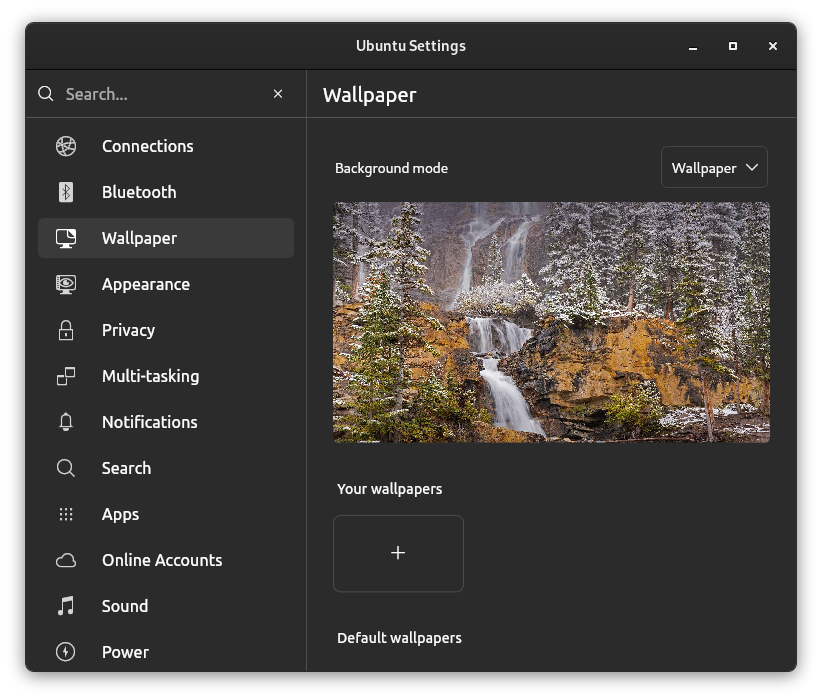
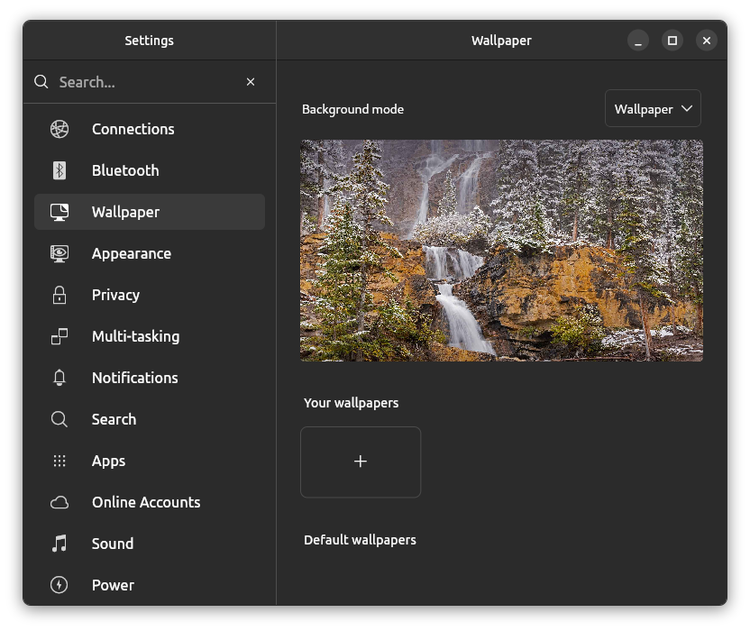
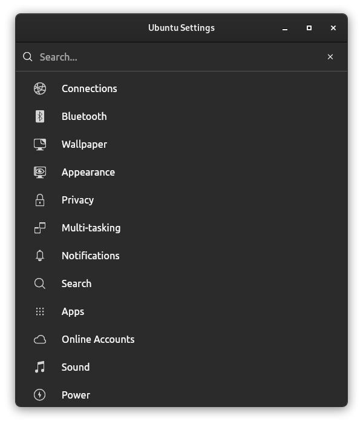
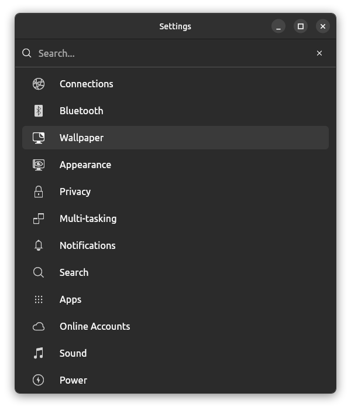
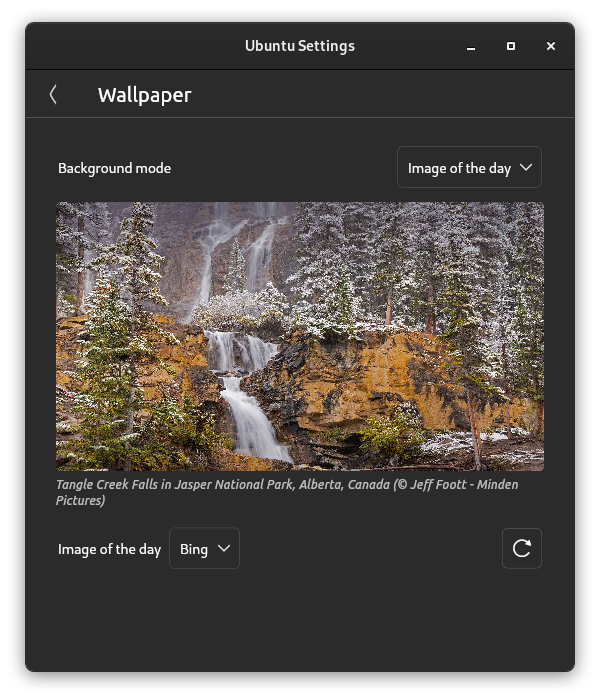
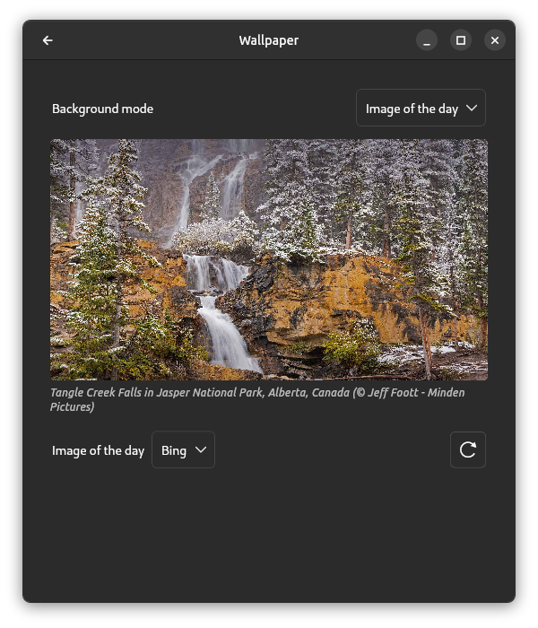

# Flutter and Linux
Flutter support for Linux is ok at best. Which leads to to a subpar developer experience. Unlike that's of the Windows and Macos platforms.

## The Problem
For the Longest time the flutter team refused to give the developer the ability to customize the titlebar of the app from the dart code. This is a big problem for linux users because the default titlebar is old (Gtk3) and doesn't fit in with the rest of the desktop.

## The Solution

To solve this we can use this package [gtk_window](https://pub.dev/packages/gtk_window).

gtk_window is a flutter "fake" appbar that works as a drop in replacement for the Material AppBar. It will allow us to add flutter widgets like these examples from the official app. 

Before             |  After
:-------------------------:|:-------------------------:
 |  
|
 |

It just feels right to have full control over the headerbar of your linux app and it allows you adopt styles like gtk4 without waiting for google to implement them.

## Disclaimer
I am actually the developer of this plugin. I just wanted to share it with the community because I think it's a great tool for linux developers. I hope you find it useful.