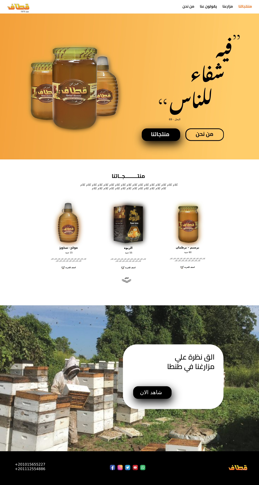
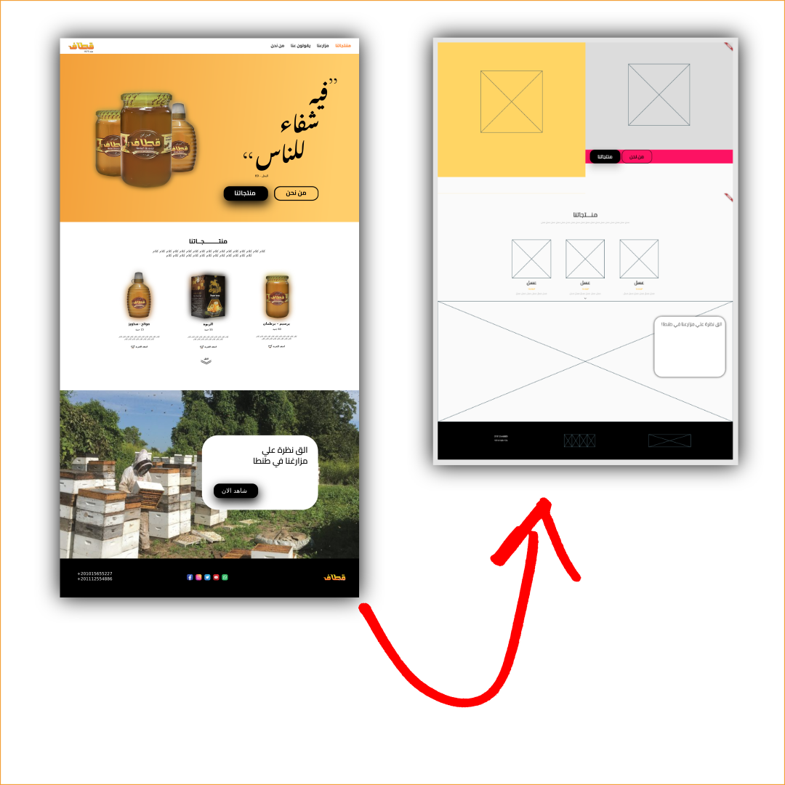
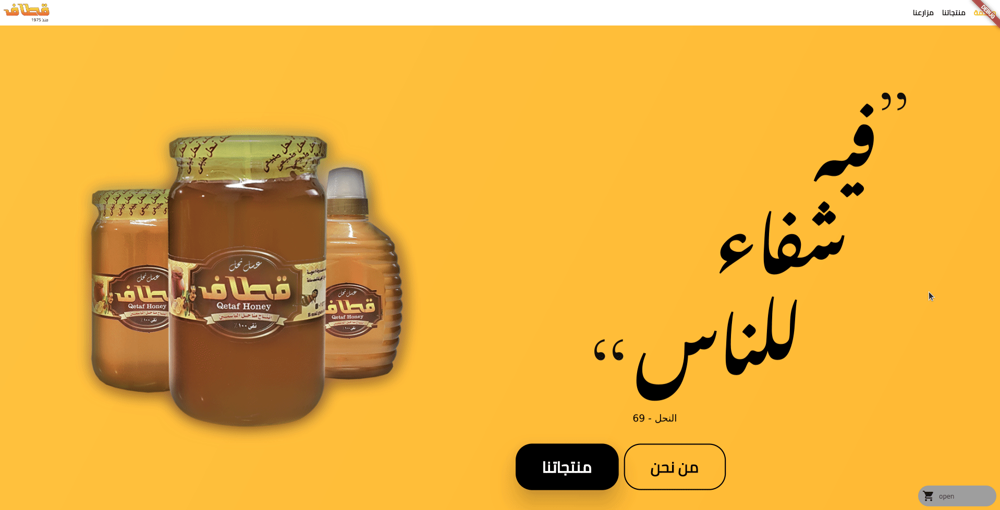
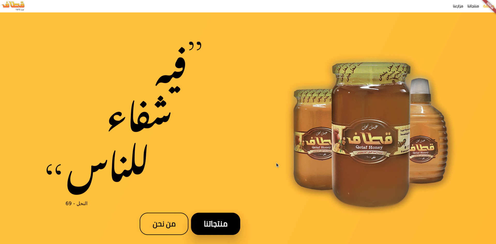
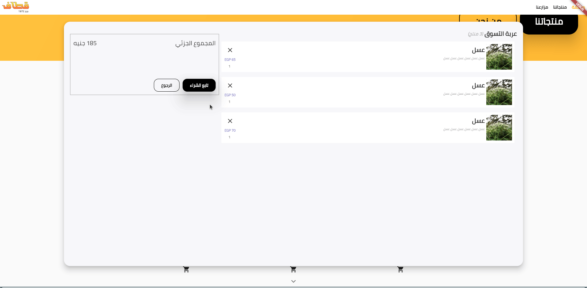
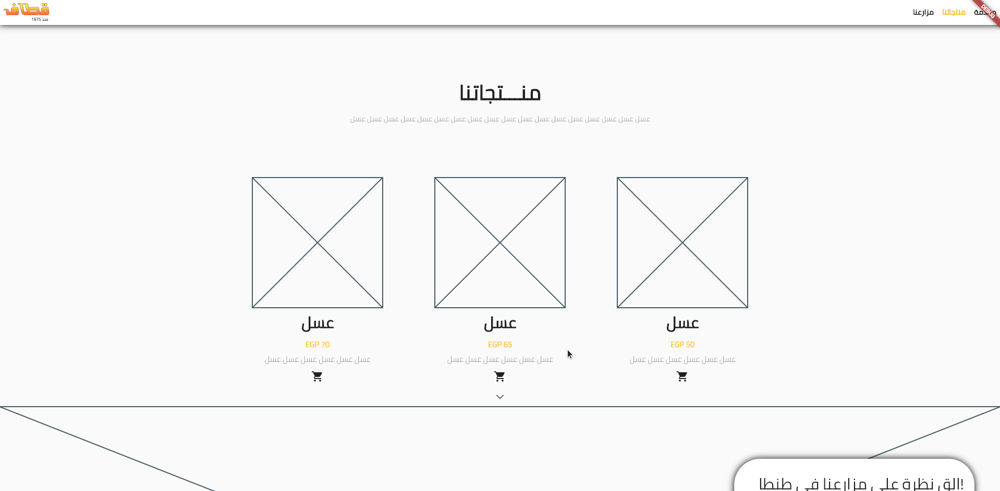
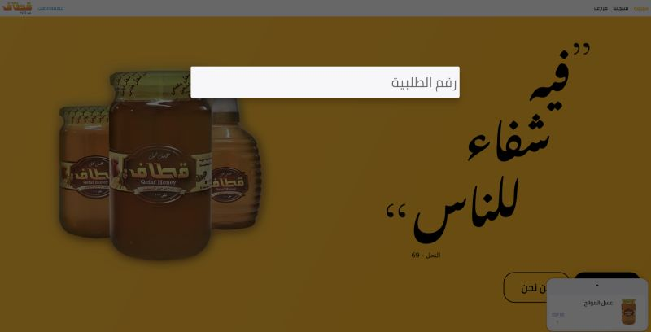
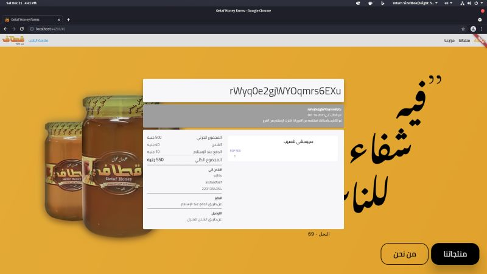

# Qetaf project devlogs summary:

Client's requested features: 

- One page design with no complicated navigation.
- Easy and intuitive to order from it.
- The website should display the business's products and a way to order them.

## Day 1 - Design: 



The first thing I did was opening up a design software since the client didn't provide me with a design. So I would design it myself. 

 After 3-4 hours I settled on the basic skeleton design attached below and the client agreed on it. 


## Day 2 - Skeleton:   

Today we're going to start coding. So I made a new flutter web project with 

flutter create qetaf

Then I started to add the basic folder structure. I usually make my projects as following: 
```
    lib/ 
        main.dart 
        home_page.dart
        models/ 
        routing/ 
        navigation/ 
        widgets/ 
            top_section.dart 
            products_section/ 
                products_section.dart 
                widgets/ 
                    product_card.dart 
```
  
and so on. 
So I laid down all of the widgets and classes but I didn't add any routing or API calls yet. 
  
In this stage, I like to make all of the widgets at once so I can have a final image of the website faster. 
Of course, this will decrease the quality of the widgets but I find that approach to be much more efficient than perfecting every widget one at a time. 
  
The finished product at this stage is like a Picasso drawing. It's full of colors and placeholders for future API received data. I know it's not pretty and maybe buggy. But now you can see which widgets deserve your time more to perfect and which can be postponed. 


## Day 3 - Navigation & assets loading:    

Today I am going to lay down the navigation foundation. 

Objectives: 

- Do a single page scrolling navigation style in which a navbar updates on scrolling, and on pressing on the navBar, the list scrolls accordingly. 
- Remove the mapping colors and load some basic assets. 

  
First, I thought to use scaffold and appBar, but after a couple of attempts, I found it was too restrictive for my taste, and I wasn't going to get the design I wanted. 
  
So the plan is to custom it. I used a stack to lay the navBar on top of the other widgets. 
The values for the items on the navBar were hard-coded and created by a loop. 

    
    _for (var pageIndex = 0; pageIndex < pages.length; pageIndex++)
    

I wrapped the sections by a ScrollablePositionedList so I can get the postion of the list and scroll to a specific index on the list. 
  
Now I used a ValueListenableBuilder for the navbar so it can react to the list changes. And it works like a charm now. 
  
  
Now what's left is to scroll to a specific index when pressing on an item in the navbar, which is easily done by "itemScrollController.scrollTo(index)" provided by the ScrollablePositionedList widget. 
  
  
Now everything seems to be working correctly. All we have to do now is to replace some of the placeholders with actual graphics. 
  
I tried to load the assets locally, but whatever I have done they don't load when deployed to firebase, so I just put them as links. 
  
To get assets loading correctly, I had to tinker with 'cors' settings on firebase, because it is off by default to link assets from other domains. 
  
 I am not going into navigation 2.0 and deep links today because I need to finish the ordering system and the schedule is tight. 


## Day 4 – Cart:  

  
Today I made a cart widget that has animations. 
As per the design specifications, I wasn't allowed to add any complicated navigation, so the order page will be rendered as a dialog box styled page, so the user is on top of everything all the time.

Everything will be animated, so the user is not confused about what goes where.


I first started with the cart widget and added an animated builder to expand and compress the widget.
I achieved that effect by using ClipRect with Align and its property height factor. It allowed me to animate the height of the widget by 

```dart 
    _controller
                .drive(CurveTween(curve: Curves.easeInOutCubic))
                .value
```   


The cart only has two buttons now. One to expand and one to go to the ordering page. And a text widget between them as a placeholder for the products.

When pressing the order button it "Navigator.push()" to a simple grey placeholder for the ordering process page.

I wrapped both the ordering page and the Cart widget in a Hero for a beautiful animation interpolation. 
Now, I shall add a simple ordering form and complete the cart.

## Day 5 – Cart Design:


Today I am going to add functionality to the cart system with provider.

First I added a ChangeNotifier provider above the homepage widget so the the whole page can access it.

I created two classes

- Product details, which has stuff like price and name
- Product listing, which has product details and a quantity integer.

I added an add, remove and update functions to the cart class we made yesterday.

I added an icon button beneath the product car widget and add onPressed to call the add function.


Now what's left is to show available products in the cart so I added a consumer which by using a for loop renders the cart contents with the Product Listing Widget

I added an icon button that calls the remove function of CartModel.

I stylized the order button a bit and added a total price text.

That's what I have done today. It's not much ,but tomorrow is an exciting day because we're going to dive in the ordering page.


## Day 6&7 – Cart and order details screen:

Today we're going to finish the cart design and add the first page in the ordering system which is the ordering details screen.

The listing in the cart had to be rewritten without using ListTile because of its design constraints. So I remade it.

The button to expand the cart was a bit bare-bones so I made it show the last item added item to the cart. I needed to update the add function to remove and re-add a product if its already in the cart then update its quantity, to make the button show the latest item added.

Every time I added a widget that has the text direction attributes, I needed to specify I want it to be RTL every time. So to avoid redundancy I used the directionality widget to force all children to use the RTL text direction.

Finally, I made a simple checkout page that shows the products list and a widget to show the total price.

I added 2 buttons one to return to the homepage and one that does nothing for now but it should navigate to the next section of the ordering process when I make them tomorrow.


## Day 8&9 – Order details screen 2: 


Now, I am going to work on the order details page.  

I created a pageView, and the two black&white buttons control it. 

On the new orderdetails section I created 2 expandable card address and paymet_method, that will let the user update them in the future. 

I also created two radio buttons to specify the delivery method. 

On the logical part, I created a ChangeNotifierProvider with an OrderingProcessModel.  

The new model controls the whole UI to do stuff like not allowing two widgets to be updated at the same time like the folowing

```dart
#Add stausEnum Enum to track status
enum statusEnum { 
  onProductsSection, 
  editingAddress, 
  editingPaymentOptions, 
  onCompleteProductDetailsSection 
} 
```
```dart
#Povide data like total price as; 

double calculateTotalPrice() { 
   double sum = cart.calculateTotalPrice() + deliveryMethodEnumDetails.getValue(deliveryMethod)['price'] + 10; 
   return sum; 
  } 
```
 
#Provide shipping method as a deliveryMethodEnum; 
```dart
enum deliveryMethodEnum { pickup, fedex } 
```
 
```dart
#To store each deliverymethod data I created a helper class 
class deliveryMethodEnumDetails { 
  static Map getValue(deliveryMethodEnum deliveryMethod) { 
   switch (deliveryMethod) { 
    case deliveryMethodEnum.fedex: 
     return { 
      'name': 'FedEx', 
      'price': 40, 
      'icon': Icons.delivery_dining_rounded, 
      'estimatedDeliveryTime': '2 - 3 days' 
     }; 
  } 
}  
```

That's it for today. Tomorrow I hope I could get a working prototype so I can integrate an API with it, and pitch it to the client to see if they need any more updates before I start polishing the design and the code. 

 
## Day 10 - Order details screen 3:

Today I added all the missing components in the order details section like the address, payment, delivery methods widgets.

 

I also updated the sidePanel widget to show a summary of what the user have chosen for better UX.

Now the buttons in the sidePanel act like a next and back buttons.

At the last status, which is 'order-review' the next button calls the done order widget that tries to make an order.

The back end is not configured yet, so the order confirmation screen shows a dummy procedure.

This day marks the first functional prototype. Now what's left is adding the APIs then a design polishing and animation then finally testing.

 

Tomorrow I will add the back-end by Firebase cloud functions for the time being because the client's back-end is not ready yet.


## Day 11 – Polishing and testing: 

Today I stopped working on new features and pitched the website to the client to get a green light. The client liked the website and had minor edits only. So I started polishing and testing. 

First I fixed the products list to adapt properly to different screen sizes. I used the Wrap widget and animated container to get the desired effect. 

Second I added minor details like: 

- Showing free if shipping is 0.
- Unionize most of the colors to orange – the app's accent color.
- Fixed the text direction on some of the app's components like cart. 
- Made a custom transition in the hero animation between the cart and order details screen. 
- Empty the cart on completing an order.
- Add a title and icon to the website.
- Fix total price bug. 
- Add functionality to the buttons on the WelcomeSection.
- Translate all of the remaining English words into Arabic.
- Add an error message if user didn't enter an Address.

 

Second I started adding the assets to the website on the products page and the AboutusSecton. 

Now, I shall adapt the website to mobile devices and improve the performance of the app.


## Day 15 Back-end:  


Over the last 3 days I was bashing my head against my desk planning the web-app back-end structure then I decided to use the KISS principle (Keep it simple, stupid). The website is not supposed to get a huge amount of traffic so most of the back-end systems can be done manually. 

Stuff like switching orders' statuses from processing to confirmed and data verification can be done manually with no back-end automation whatsoever. 

 

I settled on a no-login design so the user doesn't need to enter his email. Just his phone number for shipping. I will need to make some kind of Captcha but that's a problem for another day. 

First I created a collection on Firebase Firestore to contain the orders. And created an order tracker button that shows the order status like "confirmed", "Delivered", and the items in it with the sidePanel for summarization. 

I needed to refactor a lot of the code to be better understood as I didn't plan properly for this project. 

 For now, if the customer wants to update the order or delete it. He has to call the website support. 

Now we're going to add the functionality to make an order . 

 

I created a class and called it OrderModel and added to it the orderStatusEnum 
enum orderStatusEnum { processing, confirmed, shipped, delivered, cancelled }

And the class orderStatusEnumOptions{} to store values related to each enum value 

I fired up Firebase cloud functions and made a Typescript file. 

 

Made a makeOrder function that takes a map of an order and adds current time to the order then saves it to the orders collection as an order with a custom random document name. 

And now we have a functioning app. It certainly needs more polishing and code refactors. But it's good enough for a closed beta. 

 

To get it to the production state I will need to: 

- Add Security measures such as reCaptcha and preventing unverified requests. The app doesn't collect high-risk data like credit cards, emails and doesn't use- passwords either, so I wouldn't worry much about it. 
- Make an Admin companion app so the company can monitor and update orders. This app will need to have user authentication and strict security measures. 
- The app needs to work on small screens like mobile phones flawlessly. And the performance needs to be matched down to lower-end devices too. 
- Ordering by credit cards is currently not available and it needs to be worked out. 
- The app still uses the old Navigation 1.0 and needs to be upgraded to 2.0 with deep links 
- Some features like the Product details screen are still not implemented yet and they need to be. 
- Pictures on the website need to be retaken because of low quality. 
- The website needs to be migrated to the client's domain and backed too if and when it's finished. 


That's it for this devlog. I will continue the rest of the development offline because some of the algorithms on the back-end need to be confidential. 

There's not much left anyway so you're not missing a lot. 

 

The website is available now on my domain if you wanted to test it and give me feedback. 

Pull requests on GitHub are welcome. 

 
